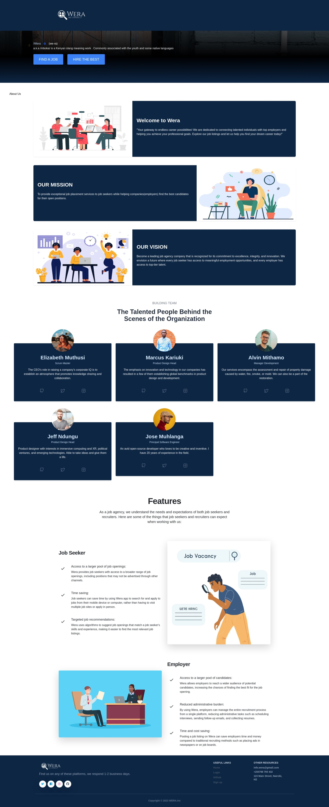
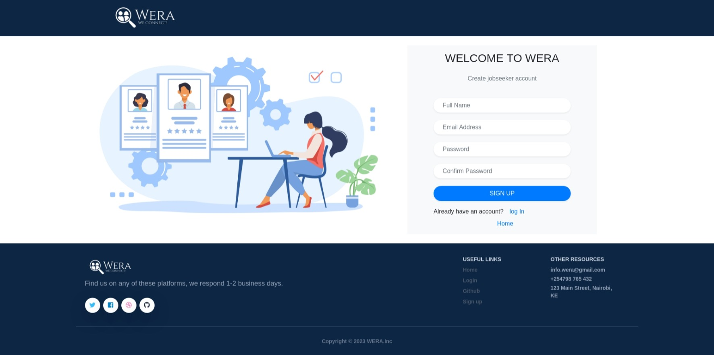
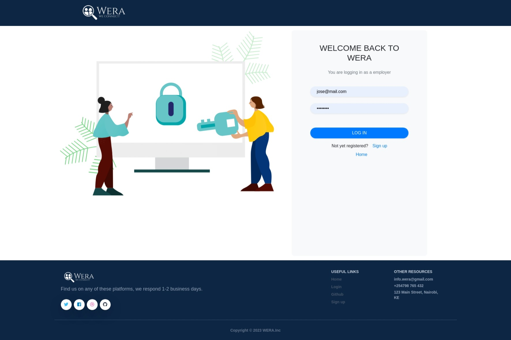
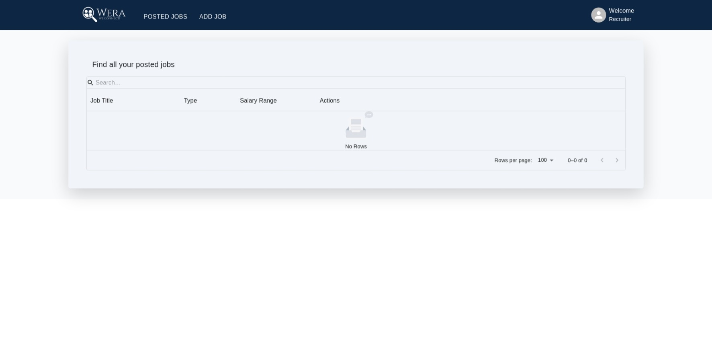
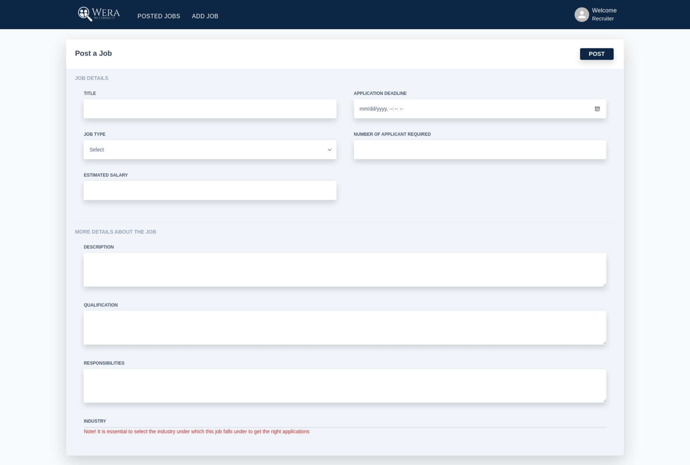
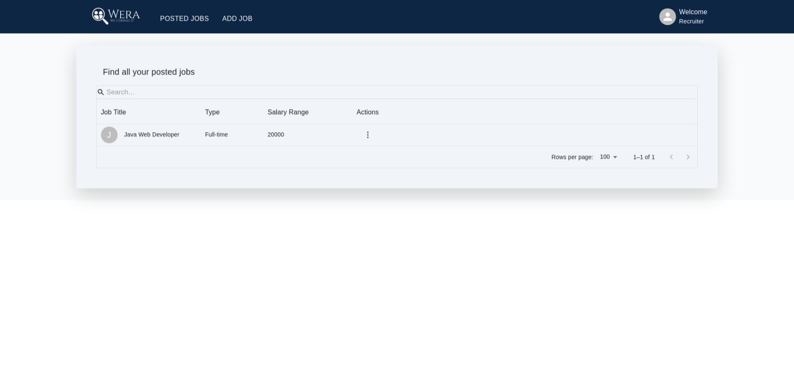

# Wera Frontend

## Description
This is the front end of the Wera job application site that utilises the React framework

## Contributors

- [alvinsleek](https://github.com/alvinsleek)
- [ndungu-jeff](https://github.com/ndungu-jeff)
- [marcus-kariuki](https://github.com/marcus-kariuki)
- [Elizabeth-M-M](https://github.com/Elizabeth-M-M)
- [Lik10280](https://github.com/Lik10280)
- [JMuhlanga](https://github.com/JMuhlanga)

## Technologies Used
1.  REACT
2.  HTML
3.  CSS
4.  Ruby on Rails
5.  Figma

## Screen Shots of the front-end

## Home Page

This is the first page that users encounter when they get to our site.

## Job Seeker Sign-up page

This page allows a job seeker to make an account to access this page.

## Job Seeker Log-in page

After registration is a success a job seeker would be required to log-in through this page.

## Employer Sign-up Page 

This page allows employers to sign up to the platform. 

## Employer Log-in Page

After a successful sign up the employer is able to log-in. 

## Employer Landing Page without Jobs

After a successful log-in , the employer is led to their landing page which consists of some of the jobs that they may have. 

## Employer Add Job

This page allows an employer to add a job listing from their organisation.

## Employer Landing Page With Job

After a Job is added, an employers landing page would be updated with their new entry. 

## 

